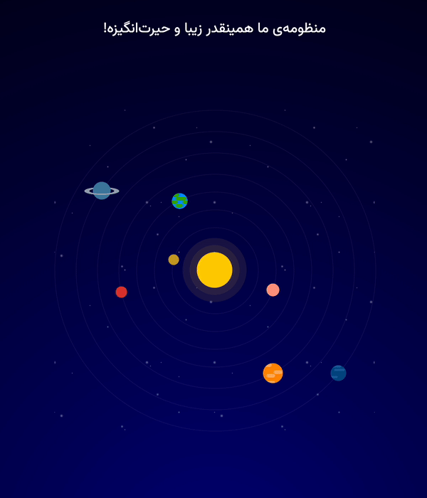

# Solar System Simulation

## Introduction

This GitHub repository contains a mesmerizing solar system simulation built with HTML, CSS, and JavaScript. Explore the beauty of our celestial neighborhood right in your browser! Each planet gracefully orbits the sun, showcasing its unique characteristics and movements.

Preview of script:

